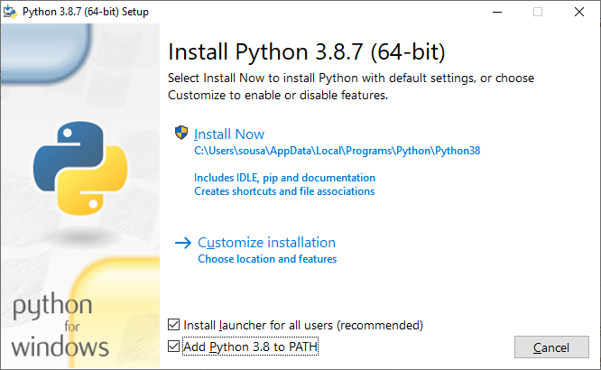

# Configuração do Ambiente

Nesse documento, você encontrará as instruções necessárias para configurar o ambiente Python necessário para o desenvolvimento do projeto.

## Instalação do Python

### Windows

Para instalar o Python no Windows, basta acessar o [site oficial](https://www.python.org/downloads/windows/) e baixar o instalador.

### OBS: Video de instalação do python no teams da turma

Lembre-se de executar o instalador como administrador e marcar a opção "Adicionar Python 3.x ao PATH".



Para verificar se a instalação foi bem sucedida, abra o terminal e execute o comando `python --version`. O resultado deve ser a versão do Python instalada.

### Linux

No Linux, o Python já vem instalado por padrão. Para verificar a versão instalada, abra o terminal e execute o comando `python --version`. O resultado deve ser a versão do Python instalada. Apenas certifique-se de que a versão instalada é igual ou superior à versão 3.6.

Caso esteja utilizando o Ubuntu, você precisa instalar o pacote `python3-venv` para criar ambientes virtuais. Para isso, execute o comando `sudo apt install python3-venv`.

### macOS

No macOS, o Python já vem instalado por padrão. Para verificar a versão instalada, abra o terminal e execute o comando `python --version`. O resultado deve ser a versão do Python instalada. Apenas certifique-se de que a versão instalada é igual ou superior à versão 3.6.


## Comandos utilizados no projeto

### Criar um ambiente virtual

Para criar e ativar um ambiente virtual Python no Windows, execute os seguintes comandos:

```bash
python -m venv .venv
.venv\Scripts\activate
```

Caso aconteça um erro ao executar o comando `.venv\Scripts\activate`, você pode habilitar a execução de scripts PowerShell com o comando `Set-ExecutionPolicy -Scope Process -ExecutionPolicy Bypass` e tentar novamente.


### Instalar o Django

Para instalar o Django, execute o seguinte comando:

```bash
pip install django
```

### Criar um projeto Django

Para criar um projeto Django, execute o seguinte comando:

```bash
django-admin startproject nome_do_projeto .
```

### Criar uma aplicação Django

Para criar uma aplicação Django, execute o seguinte comando:

```bash
python manage.py startapp nome_da_aplicacao
```

### Executar o servidor de desenvolvimento

Para executar o servidor de desenvolvimento do Django, execute o seguinte comando:

```bash
python manage.py runserver
```
