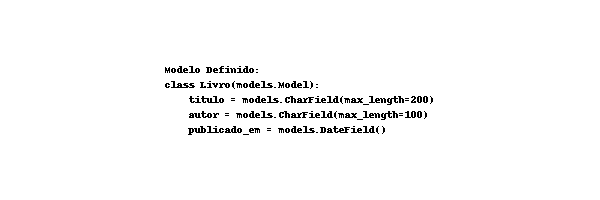
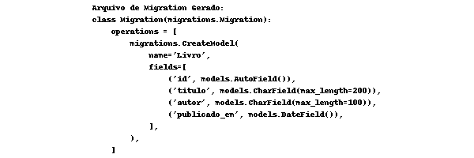

# Tutorial: Introdução às Migrations do Django
As migrations são uma parte essencial do Django, um popular framework web para Python. Elas ajudam a gerenciar mudanças no banco de dados ao longo do tempo de maneira organizada e controlada. Neste tutorial, vamos entender o que são migrations e como usá-las no Django.

## O que são Migrations?
Migrations são arquivos gerados automaticamente pelo Django que ajudam a criar e modificar as tabelas do banco de dados de acordo com as mudanças feitas nos seus modelos (models). Cada migration é como uma "fotografia" do estado atual dos modelos da sua aplicação.

## Por que Usar Migrations?
Controle de Versão do Banco de Dados: Cada alteração no banco de dados é registrada, permitindo rastrear a evolução das mudanças.
Automatização: Comando simples para aplicar mudanças no banco de dados.
Consistência: Garante que todas as alterações sejam aplicadas corretamente e na ordem certa.

## Passo a Passo: Usando Migrations no Django

### 1. Criando um Projeto Django
Primeiro, vamos criar um novo projeto Django. Abra o terminal e execute:
```bash
django-admin startproject loja .  

```
### 2. Criando uma Aplicação Django
Dentro do projeto, vamos criar uma nova aplicação chamada "livraria":

```bash

python manage.py startapp livraria

```

### 3. Definindo Modelos (Models)
Vamos criar um modelo simples para representar um Livro. Edite o arquivo livraria/models.py:
```bash
from django.db import models

class Livro(models.Model):
    titulo = models.CharField(max_length=200)
    autor = models.CharField(max_length=100)
    publicado_em = models.DateField()

```

### 4. Criando Migrations
Agora que definimos nosso modelo, precisamos criar uma migration para que o Django saiba como construir a tabela no banco de dados. No terminal, execute:

```bash
python manage.py makemigrations livraria
```
Este comando gera um arquivo de migration na pasta livraria/migrations/ que descreve a nova tabela Livro.

### 5. Aplicando Migrations
Para aplicar essa migration e criar a tabela no banco de dados, execute:
```bash
python manage.py migrate
```
Este comando aplica todas as migrations pendentes ao banco de dados.

## Exemplo Visual das Migrations
### Modelo Definido:


### Arquivo de Migration Gerado:


### Tabela no Banco de Dados:


## Fazendo Alterações nos Modelos
Se você quiser adicionar um novo campo ao modelo Livro, basta atualizar o arquivo models.py:

```bash
from django.db import models

class Livro(models.Model):
    titulo = models.CharField(max_length=200)
    autor = models.CharField(max_length=100)
    publicado_em = models.DateField()
    preco = models.DecimalField(max_digits=6, decimal_places=2)

```
E depois, criar e aplicar uma nova migration:
```bash
python manage.py makemigrations livraria
python manage.py migrate

``` 
### Resumo
Migrations são arquivos que descrevem mudanças no banco de dados.
makemigrations cria arquivos de migrations baseados nos modelos.
migrate aplica essas mudanças no banco de dados.

### Conclusão
As migrations são uma ferramenta poderosa do Django que facilita a gestão e evolução do banco de dados durante o desenvolvimento de aplicações web. Com este tutorial, esperamos que você tenha uma compreensão básica de como funcionam as migrations no Django.